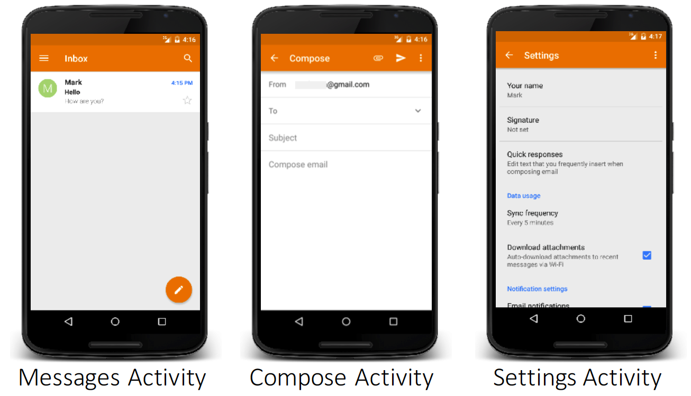

# Activities in Android

- The mobile-app experience differs from its desktop counterpart in that a user's interaction with the app doesn't always begin in the same place. Instead, the user journey often begins non-deterministically.

- The `Activity` class is designed to facilitate this paradigm.
  - When one app invokes another, the calling app invokes an activity in the other app, rather than the app as an atomic whole.
  - In this way, the activity serves as the entry point for an app's interaction with the user.
  - You implement an activity as a subclass of the Activity class.

- Whenever a new application started, `public static void main(String[])` method of `ActivityThread` is being executed.
  - The **main** thread is being initialized there, and all calls to Activity lifecycle methods are being made from that exact thread.
  - In `Activity#attach()` method the system initializes **UI** thread to **this** thread, which is also happens to be the **main** thread. Therefore, for all practical cases **main** thread and **UI** thread are the same.

- An activity provides the window in which the app draws its UI. This window typically fills the screen, but may be smaller than the screen and float on top of other windows. Generally, one activity implements one screen in an app.

- Most apps contain multiple screens, which means they comprise multiple activities.
    - Typically, one activity in an app is specified as the **main activity**, which is the first screen to appear when the user launches the app.
    - Each activity can then start another activity in order to perform different actions.



- Although activities work together to form a cohesive user experience in an app, each activity is only loosely bound to the other activities; there are usually **minimal dependencies among the activities** in an app.

- In fact, activities often start up activities belonging to other apps. For example, a browser app might launch the Share activity of a social-media app.

- To use activities in your app, you must register information about them in the app's manifest, and you must manage activity lifecycles appropriately.

## Configuring the Manifest

- Every app project must have an `AndroidManifest.xml` file,
  - with **precisely that name**
  - at the root of the project source set

- The manifest file describes essential information about your app to the Android build tools, the Android operating system, and Google Play.

- For your app to be able to use activities, you must declare the activities in the manifest.

### Declare activities

- To declare your activity, open your manifest file and add an `<activity>` element as a child of the `<application>` element. For example:

```xml
<manifest ... >
  <application ... >
    <activity android:name=".ExampleActivity" /> <!-- android:name is REQUIRED  -->
    ...
  </application ... >
  ...
</manifest >
```

### Declare Intent Filters

- Intent filters provide the ability to launch an activity based not only on an explicit request, but also an implicit one.
  - For example, an explicit request might tell the system to "Start the Send Email activity in the Gmail app".
  - By contrast, an implicit request tells the system to "Start a Send Email screen in any activity that can do the job."
  - When the system UI asks a user which app to use in performing a task, that's an intent filter at work.

- You can take advantage of this feature by declaring an `<intent-filter>` attribute in the `<activity>` element.

- The definition of this element includes an `<action>` element and, optionally, a `<category>` element and/or a `<data>` element.

- These elements combine to specify the type of intent to which your activity can respond.
  - For example, the following code snippet shows how to configure an activity that acts as the entry point of an app:

```xml
<intent-filter>
  <action android:name="android.intent.action.MAIN" />
  <category android:name="android.intent.category.LAUNCHER" />
</intent-filter>
```

- If you intend for your app to be self-contained and not allow other apps to activate its activities, you don't need any other intent filters.

- Activities that you don't want to make available to other applications should have no intent filters, and you can start them yourself using explicit intents.

- Read more about [Intents and Intent Filters](https://developer.android.com/guide/components/intents-filters)

### Declare Permissions

- You can use the manifest's `<activity>` tag to control which apps can start a particular activity.

- A parent activity cannot launch a child activity unless both activities have the same permissions in their manifest.

- If you declare a `<uses-permission>` element for a parent activity, each child activity must have a matching `<uses-permission>` element.

- For example, if your app wants to use a hypothetical app named SocialApp to share a post on social media, SocialApp itself must define the permission that an app calling it must have:

```xml
<manifest>
  <activity android:name="...."
    android:permission="com.google.socialapp.permission.SHARE_POST"

/>
```

- Then, to be allowed to call SocialApp, your app must match the permission set in SocialApp's manifest:

```xml
<manifest>
   <uses-permission android:name="com.google.socialapp.permission.SHARE_POST" />
</manifest>
```

- Read more about [Security and Permissions](https://developer.android.com/guide/topics/security/security)

## Managing the Activity Lifecycle

- Over the course of its lifetime, an activity goes through a number of states. You use a series of callbacks to handle transitions between states. The following sections introduce these callbacks. (read more about [The Activity Lifecycle](https://developer.android.com/guide/components/activities/activity-lifecycle))

### `onCreate()`

- **You must implement this callback**, which fires when the system creates your activity.
- Your implementation should initialize the essential components of your activity: For example, your app should create views and bind data to lists here.
- Most importantly, this is where you must call setContentView() to define the layout for the activity's user interface.
- When `onCreate()` finishes, the next callback is always `onStart()`.

### `onStart()`

- As `onCreate()` exits, the activity enters the `Started` state, and the activity becomes visible to the user.
- This callback contains what amounts to the activity's final preparations for coming to the foreground and becoming interactive.

### `onResume()`

- The system invokes this callback just before the activity starts interacting with the user.
- At this point, the activity is at the top of the activity stack, and captures all user input.
- Most of an app's core functionality is implemented in the `onResume()` method.
- The `onPause()` callback always follows `onResume()`.

### `onPause()`

- The system calls `onPause()` when the activity loses focus and enters a `Paused` state.
  - This state occurs when, for example, the user taps the Back or Recents button.
  - When the system calls `onPause()` for your activity, it technically means your activity is still partially visible, but most often is an indication that the user is leaving the activity, and the activity will soon enter the `Stopped` or `Resumed` state.

- An activity in the `Paused` state may continue to update the UI if the user is expecting the UI to update.
  - Examples of such an activity include one showing a navigation map screen or a media player playing.
  - Even if such activities lose focus, the user expects their UI to continue updating.

- You **should not use** `onPause()` to save application or user data, make network calls, or execute database transactions. For information about saving data, see [Saving and restoring activity state](https://developer.android.com/guide/components/activities/activity-lifecycle#saras).

- Once `onPause()` finishes executing, the next callback is either `onStop()` or `onResume()`, depending on what happens after the activity enters the Paused state.

### `onStop()`

- The system calls `onStop()` when the activity is no longer visible to the user.
  - This may happen because
    - the activity is being destroyed
    - a new activity is starting
    - an existing activity is entering a `Resumed` state and is covering the stopped activity
  - In all of these cases, the stopped activity is no longer visible at all.

- The next callback that the system calls is
  - either `onRestart()`, if the activity is coming back to interact with the user
  - or by `onDestroy()` if this activity is completely terminating

### `onRestart()`

- The system invokes this callback when an activity in the `Stopped` state is about to restart. `onRestart()` restores the state of the activity from the time that it was stopped.

- This callback is always followed by `onStart()`.

### `onDestroy()`

- The system invokes this callback before an activity is destroyed.

- This callback is the final one that the activity receives. `onDestroy()` is usually implemented to ensure that all of an activity's resources are released when the activity, or the process containing it, is destroyed.


## Scenario: Launch app from home, then return home

Launch:

- `activity.onCreate()`
- `activity.onStart()`
- `activity.onResume()`
- `activity.onWindowFocusChanged(true)`

Note: Launching already-running app is similar, except a call to activity.onRestart() will occur instead of onCreate().

Press Home:

- `activity.onUserInteraction()`
- `activity.onUserLeaveHint()`
- `activity.onPause()`
- `activity.onWindowFocusChanged(false)`
- `activity.onSaveInstanceState()`
- `activity.onStop(); isChangingConfigurations() returns false`
