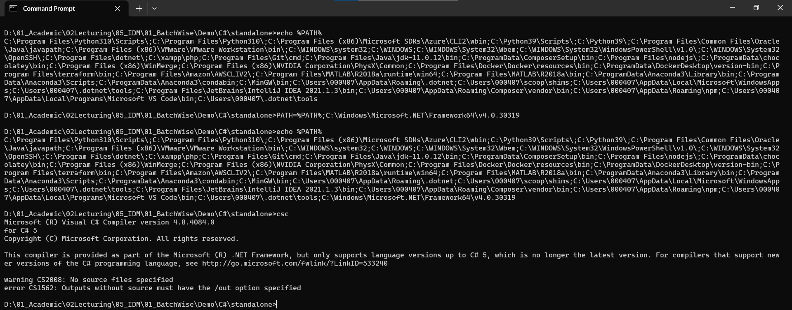
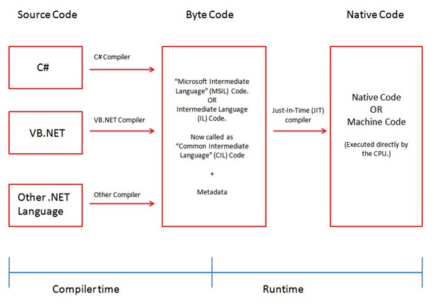

# Unit 1 - Programming 

## 2.1. C# Introduction

- Object-oriented Programming language created and maintained by Microsoft
- general-purpose
- high-level
- Multi-paradigm
	- static typing
	- strong typing
	- lexically scoped
	- imperative
	- declarative
	- functional
	- generic
	- object-oriented (class-based)
	- component-oriented

## 2.2. Setting up the Dev Environment

- Download and install the [.NET coding pack](https://aka.ms/dotnet-coding-pack-win). This will install Visual Studio Code IDE, and the .NET SDK 7.0.
- You also can use the existing C# Compiler (`csc.exe`) which is bundled into your existing .NET Framework installation.
- Setting the PATH
	1. Find the location at which the CSC is installed (e.g. C:\Windows\Microsoft.NET\Framework64\v4.0.30319)
	2. Open a Command Prompt session
	3. Set the path value `PATH=%PATH%;C:\Windows\Microsoft.NET\Framework64\v4.0.30319`
	4. Run the command csc to verify.



## 2.3. First Application

- C# is text-based. You may use any text editor to write the code.
```c#
using System;

class HelloWorld {
  static void Main(string[] args) {
    Console.WriteLine("Hello, world!");
  }
}
```
- Save this file with any name + `.cs` extenstion. (e.g. `first.cs`)
- Open the saved location in a command prompt
- Set the PATH
- Run `csc first.cs`. This will generate `first.exe` in the same location.
- Run the application with `first`; you'll see `Hello, world!` on the console output.

## 2.4. C# Compilation Process



- Compiler mainly performs two tasks
	- Check the syntax (i.e. spelling and grammar of the code); if there are sytax errors, the compiler will stop processing.
	- Generation of the IL code

## 2.5. C# Reserved Words

C# has reserved some words. These words build the notations of the language and hence are reserved. You can't use these for any other purposes ([C# Keywords | Microsoft Learn](https://learn.microsoft.com/en-us/dotnet/csharp/language-reference/keywords/)).

```
abstract         event            namespace           static
as               explicit         new                 string
base             extern           null                struct
bool             false            object              switch
break            finally          operator            this
byte             fixed            out                 throw
case             float            override            true
catch            for              params              try
char             foreach          private             typeof
checked          goto             protected           uint
class            if               public              ulong
const            implicit         readonly            unchecked
continue         in               ref                 unsafe
decimal          int              return              ushort
default          interface        sbyte               using
delegate         internal         sealed              virtual
do               is               short               void
double           lock             sizeof              volatile
else             long             stackalloc          while
enum
```
## 2.6. C# Procedural Programming

- In C#, procedures are known as ***methods***.
- These are callable/invocable components in a program.

```c#
using System;

class ProceduralProgram {
  static void Main(string[] args) { //---------(1)
    int sum = Add(15, -20);         //---------(3)
    Console.WriteLine(sum);
  }

  static int Add(int n1, int n2) {  //---------(2)
    return n1 + n2;
  }
}
```

In the above example
1. This is the main entry point of the program. This is what will be executed at first.
2. This is a method declaration. Here we define what the method is (method signature), and what it does (method body)
3. This is the call/invocation of the method. Here
	- `Main` method is calling the method `Add`; hence `Main` is the ***caller***
	- `Add` method is being called by `Main`; hence `Add` is the ***callee***

***
[Home](README.md) | [Prev](01_Intro.md) | [Next](03_ConstVar.md)