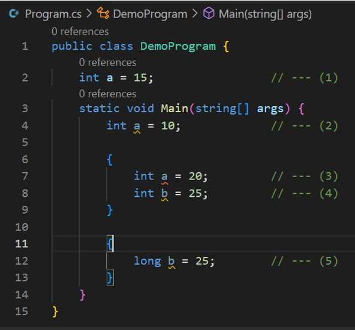
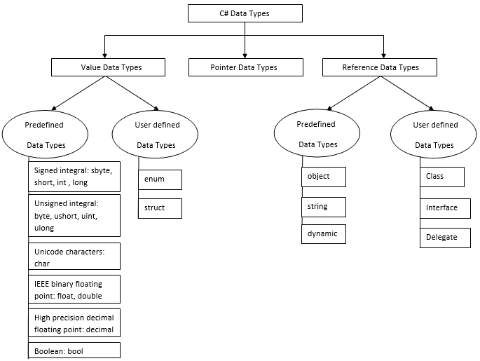

# Unit 1 - Programming 

[Home](README.md) | [Prev](02_CSBasics.md) | [Next](04_Operators.md)

## 3.1. Variables

- Variables represent storage locations.
- Every variable has a type that determines what values can be stored in the variable.
- C# is a type-safe language, and the C# compiler guarantees that values stored in variables are always of the appropriate type.
- The value of a variable can be changed through ***assignment*** or through ***use of the ++ and -- operators***.
- A variable shall be definitely assigned before its value can be obtained.
- Syntax:

```csharp
class Demo {
  static void Main(string[] args) {
    // Declaration
    type identifier;

    // Initialization
    identifier = value;

    // Declaration and initialization
    type identifier = value;

  }
}
```
Read more about variables at [Variables - C# language specification | Microsoft Learn](https://learn.microsoft.com/en-us/dotnet/csharp/language-reference/language-specification/variables)

")

- In the above example
	1. <b style="color: green;">&#x2713;</b> Declaration of variable `num1`
	2. <b style="color: green;">&#x2713;</b> Initializing `num1` to value `20`
	3. <b style="color: green;">&#x2713;</b> Declaring `num2` and initializing it to value `10`
	4. <b style="color: red;">&#x2715;</b> Trying to read the value from `sum` which has not been initialized

## 3.2. Constants

- Constants are immutable values which are known at compile time and do not change for the life of the program.
- Constants are declared with the const modifier.
- Only the C# built-in types (excluding System.Object) may be declared as const.
- User-defined types, including classes, structs, and arrays, cannot be const.

")

- In the above example
	1. Gravitational constant $G$ is defined with its value in ***class-level***
	2. Mathematical constant $\Pi$ is defined with its value computed in ***class-level***
	3. Speed of light $C$ is defined with its value computed in in ***method-level***
	4. Reading a constant

## 3.3 Scope of a Member

- Static variables, local variables, constants are alrogether referred to as ***members***.
- Scope: The area of a code block that the members are visible within; In general, the area enclosed by curly braces (`{}`) can be regarded as a scope.
- There are several different scopes
	1. Class Scope
	2. Local Scope of a Method (nested within the class-scope)
	3. Control Structure's Local Scope (nested within the local scope)
	4. Anonymous Local Scope (can be nested within any of the above)
- A member defined in a particual scope, will be visible from anywhere within that scope (even the nested scopes)


```csharp
class Program {
  // Class Scope                           --- (1)
  static void Main(string[] args) {
    // Local Scope of a method             --- (2)
    
    construct() {
      // Control Structure's Local Scope   --- (3)
    }

    {
      // Anonymous Local Scope             --- (4)
    }
  }
}
```



- In the above
	1. This is the class-scope.
	2. This is the method's local scope. Here using the same identifier as a member in the class scope is allowed. In fact, these are treated as two different variables.
	3. This causes a compile time error, because the identifier `a` is already used in the local scope. This results in `A local or parameter named 'a' cannot be declared in this scope because that name is used in an enclosing local scope to define a local or parameter [cs_learn]csharp(CS0136)`
	4. This is a variable that won't be visible outside of the scope it is defined.
	5. Here, we use the same identifier as point 4 above (`b`) with a different type. This won't cause any errors because these are two unrelated scopes.

## 3.4 Types System

- C# is a statically-typed (Compiler checks the type compatibility during the compile-time) language
- Supports dynamic typing as well
- Type Hierarchy: Types system in C# can be hierarchically depicted as follows.



Read more about [the C# type system | Microsoft Learn](https://learn.microsoft.com/en-us/dotnet/csharp/fundamentals/types/)

## 3.5 Identifiers

- Each variable, constant, namespace, class, method, enumeration needs a unique identifier

### 3.5.1 Rules for Choosing an Identifier

- Should not be a reserved word
- Should begin with alphabetical character (a-z A-Z) or an underscore (\_)
- Subsequent characters can be alphanumeric (a-z A-Z 0-9) or underscore (\_)
- Cannot contain whitespaces

### 3.5.2 Naming Conventions

- There are several naming conventions, widely used in the industry
	1. Camel Case: thisIsCamelCase
	2. Pascal Case: ThisIsPascalCase
	3. Snake Case: this_is_snake_case
	4. Kebab Case: this-is-kebab-case (<b style="color: red;">&#x2715;</b> Not supported in C#)
	5. Train Case: This_Is_Train_Case
- As far as C# is concerned
	1. Classes, methods and constants are named in `PascalCase` (e.g. `Console`, `WriteLine`, `Pi`)
	2. local variables (e.g. inside methods) are named in `camelCase` (e.g. `name`, `phoneNumber`)

***
[Home](README.md) | [Prev](02_CSBasics.md) | [Next](04_Operators.md)