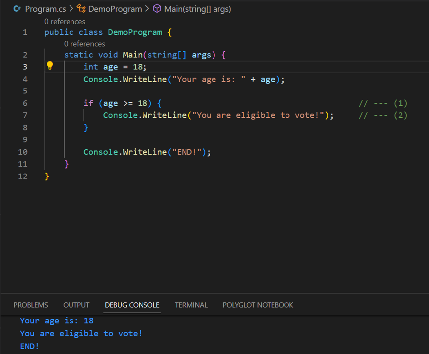
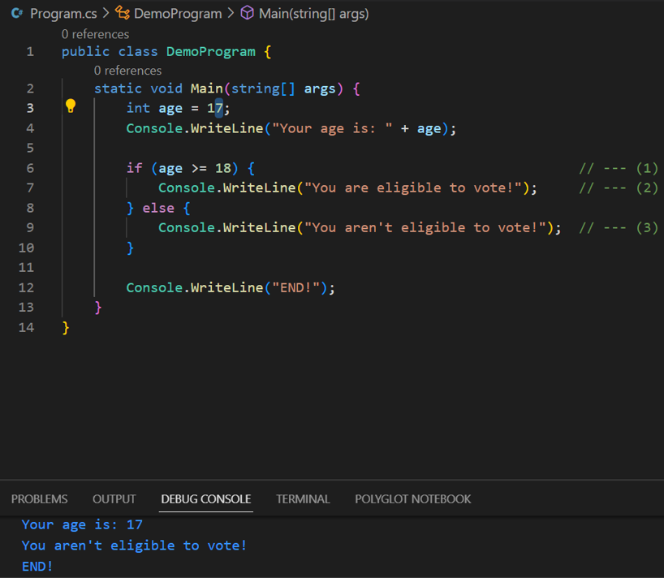
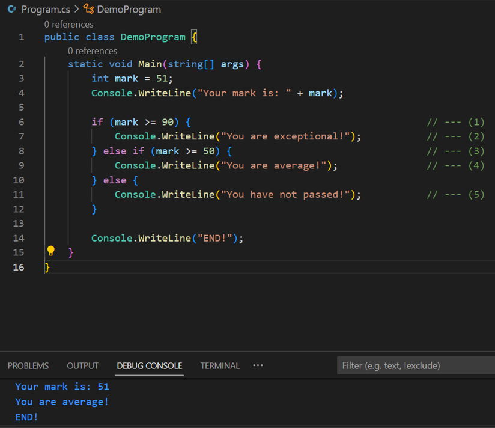
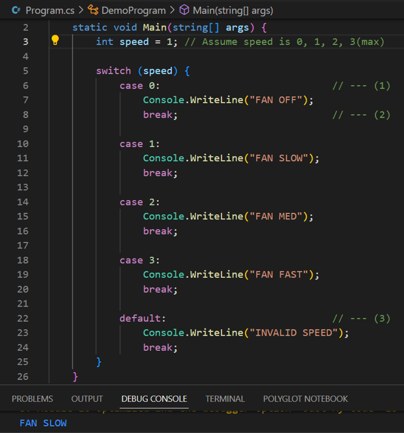
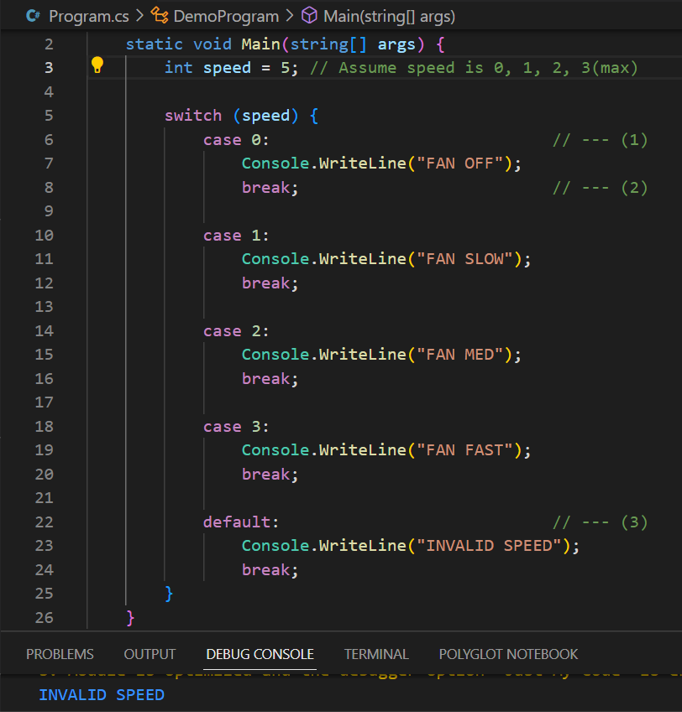
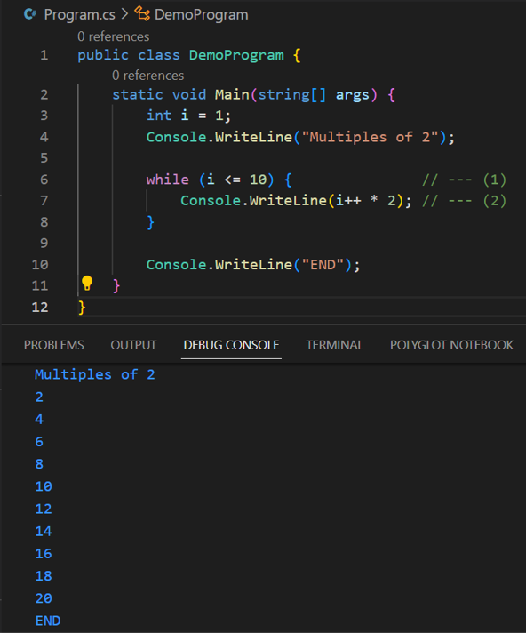
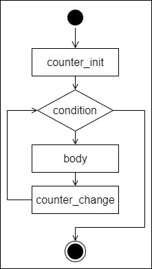
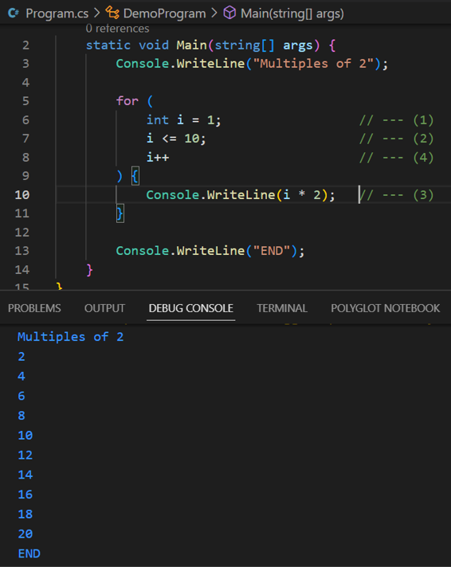
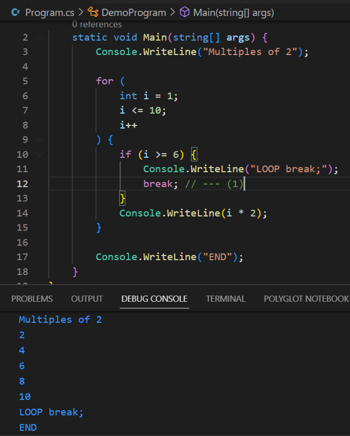
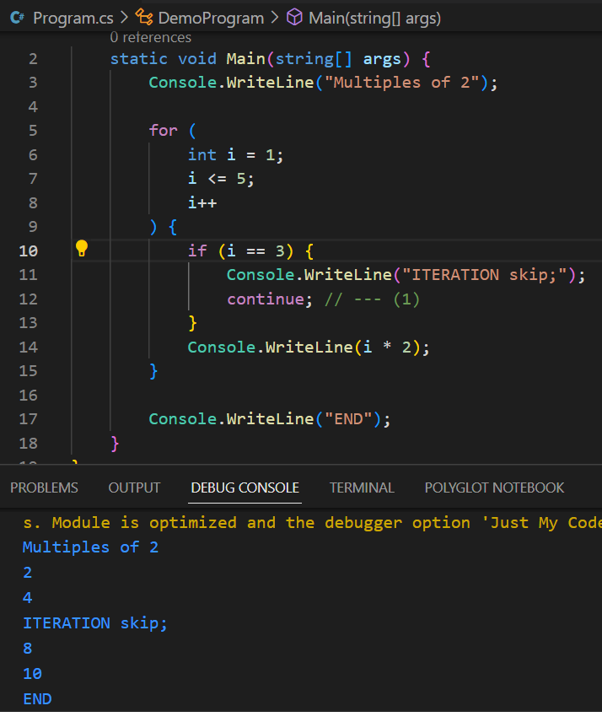

# Unit 1 - Programming 

[Home](README.md) | [Prev](04_Operators.md) | [Next](06_Methods.md)

## 5.1. Structured Program Theorem

- The [**Structured Program Theorem**](https://en.wikipedia.org/wiki/Structured_program_theorem), also called the **Böhm–Jacopini theorem**, states that a class of control-flow graphs (historically called flowcharts in this context) can compute any computable function if it combines subprograms in only three specific ways (control structures)
	- Executing one subprogram, and then another subprogram (sequence)
	- Executing one of two subprograms according to the value of a boolean expression (selection)
	- Repeatedly executing a subprogram as long as a boolean expression is true (iteration)
- Most modern languages are based on this theorem, providing a variety of ***control structures***.
- In C#, the typical syntax of control structures takes the following shape.

```csharp
conStruct (expression) {
	// body
}
```

## 5.2. Selections

- Selections in C# are made with `if-else` and `switch-case` structures.

### 5.2.1 `if-else`

- Decides if a portion of code (body) is executed or not, based on the guard condition.

```csharp
if (condition) {
	body
}
```



- In the above
	1. This is the guard condition. Whether the body is executed, is decided by this.
	2. This line will execute only if the guard condition evaluates to `True`. (i.e. `age` is greater than or equal to 18)

```csharp
if (condition) {
	body_if_true
} else {
	body_if_false
}
```



- In the above
	1. This is the guard condition. Which body (out of the two) is executed, is decided by this.
	2. This line will execute only if the guard condition evaluates to `True`. (i.e. `age` is greater than or equal to 18)
	3. This line will execute only if the guard condition evaluates to `False`. (i.e. `age` is NOT greater than or equal to 18)

```csharp
if (condition_1) {
	body_if_c1_true
} else if (condition_2){
	body_if_c1_true
...;
} else {
	body_if_condition_n_false
}
```



- In the above
	1. This is the first guard condition. Which body (out of the first two) is executed, is decided by this.
	2. This line will execute only if the first guard condition evaluates to `True`. (i.e. `mark` is greater than or equal to 90)
	3. This is the second guard condition. This will be evaluated only when the first guard condition evaluates to `False`. Which body (out of the second two) is executed, is decided by this.
	4. This line will execute only if the first guard condition evaluates to `False` and the second guard condition evaluates to `True`. (i.e. `mark` is neither greater than nor equal to 90, but greater than or equal to 50)
	5. This line will execute only if both the guard conditions evaluate to `False`. (i.e. `mark` is neither greater than nor equal to 90, also neither greater than nor equal to 50; in other words `mark` is less than 50)

### 5.2.2 `switch-case`

- This allows execution of statements for specific ***discreet values*** of a given variable. The variable acts like a `switch`.
- The behaviour is as same as the fan speed selector
- Each discreet value is a `case`. Each case needs to be separated with a `break` statement. Otherwise it will result in compile time error `Control cannot fall through from one case label ('case xxx:') to another [cs_learn]csharp(CS0163)`.
- All of the cases which are not mentioned, are handled by `default` case. This should be the last in the cases list.

```csharp
switch (variable) {
	case value_1:
		case_1_body
		break;

	...;

	case value_n:
		case_n_body
		break;

	default:
		default_case_body
		break;
}
```





- In the above
	1. This is where the switch variable is defined.
	2. Each case should be terminated with a break.
	3. This is the default case. All values for `switch` variable, which are not mentioned under any case, will be handled by this.

## 5.3 Repetition

- Repetitions in C# are handled with loops. There are four (04) different loop constructs.
	- `while`
	- `do-while`
	- `for`
	- `foreach`

### 5.3.1 `while`

- Repeatedly executes the body, until the guard condition becomes false

```csharp
while (condition) {
	body
}
```



- In the above
	1. This is the guard condition; at the beginning of each iteration, the guard condition is evaluated.
	2. Loop body will execute only if the guard condition evaluates to `True`.

### 5.3.2 `for`

- Repeatedly executes the body, until the guard condition becomes false
- In addition, enables defining a ***loop counter variable*** at the beginning of the loop, and changing it's value at the **end** of each iteration.



```csharp
for(counter_init; condition; counter_change) {
	body
}
```



- In the above
	1. This is the definition of the loop counter variable.
	2. This is the guard condition; at the beginning of each iteration, the guard condition is evaluated.
	3. Loop body will execute only if the guard condition evaluates to `True`.
	4. This is the counter change. Here it's an increment. Once the increment is done, next iterations begins from step 2.

## 5.4 Jump Statements

- Jump statements are used to control the flow from within the control structures.

### 5.4.1 `break`

- Exits from the current loop. ***Can/should*** be used only from within a loop



- In the above
	1. When this statement is hit, the loop will be exited from. Notice that nothing from 12 (i = 6) is not printed on the console output.

### 5.4.2 `continue`

- Skips the current iteration of the current loop and move to next iteration. ***Can/should*** be used only from within a loop



- In the above
	1. When this statement is hit, the rest of the current iteration will be skipped and the next iteration is initiated. Notice that the value 6 (2 * 3) is not printed on the console output.

### 5.4.3 `return`

- Exits from the current method.
- This will be discussed under [methods](06_Methods.md).

In addition to these, there is [`goto`](https://learn.microsoft.com/en-us/dotnet/csharp/language-reference/statements/jump-statements#the-goto-statement) which is ***not encouraged to use as it is deemed evil. [Here's why...](https://en.wikipedia.org/wiki/Goto).***. Code that overuses GOTO statements rather than structured programming constructs, resulting in convoluted and unmaintainable programs, is often called ***spaghetti code***.  

Read more on [Jump statements - break, continue, return, and goto | Microsoft Learn](https://learn.microsoft.com/en-us/dotnet/csharp/language-reference/statements/jump-statements)

***
[Home](README.md) | [Prev](04_Operators.md) | [Next](06_Methods.md)