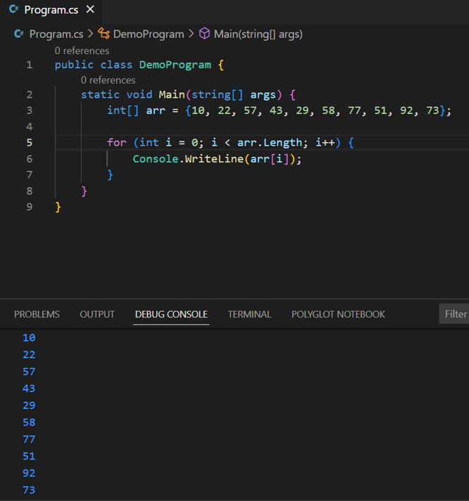
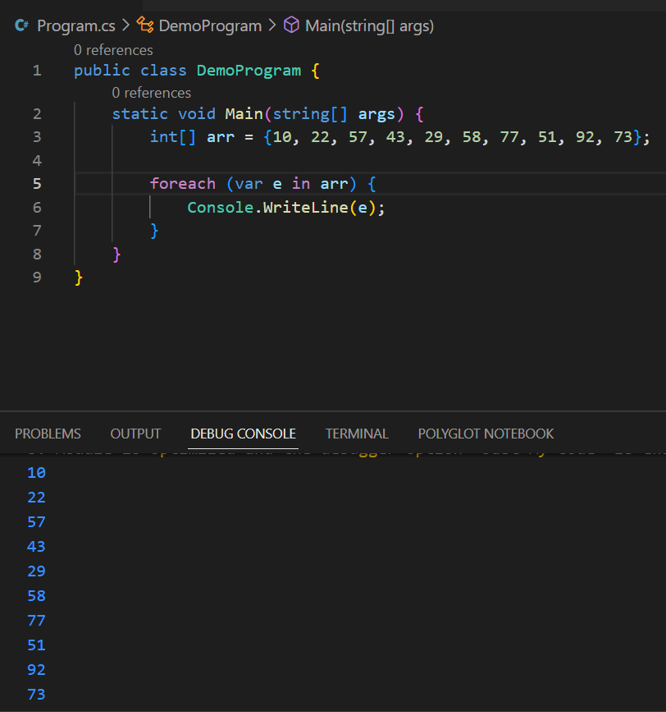

# Unit 1 - Programming 

[Home](README.md) | [Prev](05_ConStructs.md) | [Next](07_Methods.md)

## 6.1. Arrays in C\#

- You can store multiple variables of the same type in an array data structure.
- You declare an array by specifying the type of its elements.

```csharp
type[] arrayName;
```

- An array can be single-dimensional, multidimensional or jagged.
- The number of dimensions and the length of each dimension are established when the array instance is created. These values can't be changed during the lifetime of the instance.
- The default values of numeric array elements are set to zero, and reference elements are set to `null`.
- A jagged array is an array of arrays, and therefore its elements are reference types and are initialized to `null`.
- Arrays are ***zero indexed***: an array with `n` elements is indexed from `0` to `n - 1`.
- Array elements can be of any type, including an array type.

```csharp
class TestArraysClass
{
  static void Main()
  {
    // Declare a single-dimensional array of 5 integers.
    int[] array1 = new int[5];

    // Declare and set array element values.
    int[] array2 = new int[] { 1, 3, 5, 7, 9 };

    // Alternative syntax.
    int[] array3 = { 1, 2, 3, 4, 5, 6 };

    // Declare a two dimensional array.
    int[,] multiDimensionalArray1 = new int[2, 3];

    // Declare and set array element values.
    int[,] multiDimensionalArray2 = { { 1, 2, 3 }, { 4, 5, 6 } };

    // Declare a jagged array.
    int[][] jaggedArray = new int[6][];

    // Set the values of the first array in the jagged array structure.
    jaggedArray[0] = new int[4] { 1, 2, 3, 4 };
  }
}
```

## 6.2 Accessing Array Elements

- Array elements can be accessed using the index.

```csharp
//                      0  1  2  3  4
int[] arr = new int[] { 1, 3, 5, 7, 9 };

Console.WriteLine(arr[0]);  // --- (1)
Console.WriteLine(arr[1]);  // --- (2)
Console.WriteLine(arr[4]);  // --- (3)
Console.WriteLine(arr[-1]); // --- (4)
Console.WriteLine(arr[5]);  // --- (5)
```

- In the above
	1. <b style="color: green;">&#x2714;</b> Output: `1`, which is the element at the 0th index, this is the first element of the array
	2. <b style="color: green;">&#x2714;</b> Output: `3`, which is the element at the 1st index
	3. <b style="color: green;">&#x2714;</b> Output: `9`, which is the element at the 4th index, this is the last element
	4. <b style="color: red;">&#x274C;</b> Output: `IndexOutOfRangeException` in the runtime, there's no element at index -1
	5. <b style="color: red;">&#x274C;</b> Output: `IndexOutOfRangeException` in the runtime, there's no element at index 5

## 6.3 Traversing an Array

- **Traverse**: Starting from one point, going through each element of a data structures such that each element is accessed only once
- Array traversal can be done using the `for` loop as follows



- The same can be achieved using the `foreach` loop, which is a loop specially designed for traversing [linear data structures](https://www.javatpoint.com/linear-vs-non-linear-data-structure]).



***
[Home](README.md) | [Prev](05_ConStructs.md) | [Next](07_Methods.md)