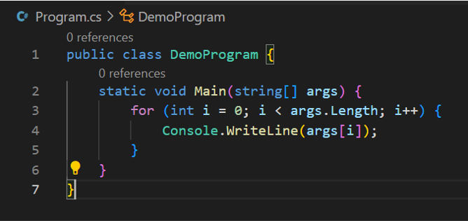
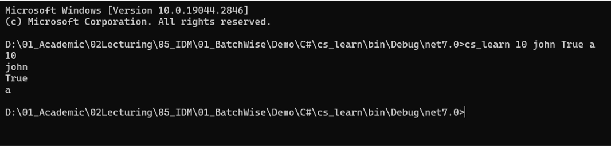

# Unit 1 - Programming 

[Home](README.md) | [Prev](06_Arrays.md) | [Next](08_DataStructures.md)

## 7.1. Methods in C\#

- Methods are the smallest reusable component in an object oriented program
- Methods (in OOP), functions, procedures refer to the same
- Structure of a method in c#

```
access_modifiers modifiers return_type identifier(type formal_param1, ... type formal_paramN) {
  body
}
```

- Subsequent sections describe each of these components separately (except for **access modifiers** and **modifiers**)

## 7.2 Defining Methods

- During the method definition, it signals the execution environment (in this case .NET runtime) the existence of a method
- The following information about a method should be included in the definition
	- Return Type: the data type that will be returned from the method
	- Identifier: this identifier is used to identify the method (e.g. during calling). This should abide by the rules and conventions for choosing identifiers. 
	- Arguments/parameters: this is the list of inputs that the method is expecting to be ***passed on*** during the invocation of the method
	- Body: Statements that define the behaviour of the method
- Method Signature: Method signature is `identifier(parameters)`. This is important when methods are being ***overloaded***.

```csharp
public static void SayHello() {                     // --- (1)
  Console.WriteLine("Hello, world!");
}

public static long GetSecondsSinceEpoch() {         // --- (2)
	return DateTimeOffset.Now.ToUnixTimeSeconds();
}

public static void Send(string message) {           // --- (3)
  Console.WriteLine("Sending message " + message);
}

public static int Add(int a, int b) {               // --- (4)
  return a + b;
}
```

- In the above examples:
	1. Method identifier is `SayHello`. Has no formal parameters (nothing between the parenthesis). `void` return type and no return statements with a value.
	2. Method identifier is `GetSecondsSinceEpoch`. Has no formal parameters (nothing between the parenthesis). `long` return type and return statement in the body with some value (value provided by the invocation of another method).
	3. Method identifier is `Send`. Has one (01) formal parameter `message` which is of type `string`. `void` return type and no return statements with a value.
	4. Method identifier is `Add`. Has one (02) formal parameters `a` and `b` both of which are of type `int`. `int` return type and return statement in the body with some value (value provided by addition operator).

### 7.2.1 Return Type

- Every method in C# should be defined with a return type.
- This is one way (of the three ways) of generating output from a method.
- Returns can be two-fold
	- **Void**: This means that the method does not return an output that can be assigned to a variable. This is indicated with `void` as the return type (Ex. 1 and 3 above)
	- **Non-void**: This means that the method returns an object (in fact an object reference) as the output of the method. This can be assigned to a variable. (Ex. 2 and 4 above).
- If the method's return type is not `void`, there should be a `return` statement with a value (or an Exception thrown; this is out of scope) on each possible execution path. Otherwise it will end up in error `not all code paths return a value [cs_learn]csharp(CS0161)`.

```csharp
static double Divide(double num, double den) { // ERROR: not all code paths return a value
  if (den != 0) { // Check if the denominator is zero
    return num / den;
  }
}
```

- Whenever a `return` statement is hit
	1. If there's a return type specified, a value of the given type will be returned.
	2. Method execution will stop right there.
- **`return` in `void` methods**: For `void` methods, there can be return statements without any value.

```csharp
static void Main(string[] args) {
  int n = 15;

  if (n != 30) {
    Console.WriteLine("This method won't execute any further than the below return.");
    return;
  }

  Console.WriteLine("This will never be reachable."); // Unreachable code
}
```

### 7.2.2 Parameters

- These are the inputs to a method.
- A method can have ***any number of*** formal parameters. Each parameter should have a type, and an identifier. However, more parameters the method has, less readable/comprehensible/usable the method will become. It's encouraged not to go beyond three arguments.
	- **Monadic**: This has only one parameter. Ideal, but not always practical.
	- **Diadic**: This has only two parameters. Mostly used.
	- **Triadic**: This has three parameters. Mostly used.
- ***Parameter Arrays***
	- This is a formal parameter with `param` modifier.
	- This should be defined as the last of the parameters.

```csharp
static void Foo(int x, params string[] values) {
  // Body of the method
}
```

## 7.3 Invocation of a Method

- Methods are to be ***invoked/called*** to consume the service that it provides.
- During the invocation of a method
	- the formal parameters to be initialized with actual parameters by passing the values (ex. 1 below)
	- if there is a parameter array, that needs to be initalized 
		- either as a comma-separated list (ex. 3 below)
		- or as an array (ex. 2 below)
- If a method has a return, it can be assigned to a variable, during the invocation (ex. 1 below)

```csharp
class Demo {
  static void Main(string[] args) {
    int sum = Add(10, 15);                          // --- (1)
    Console.WriteLine(sum);

    Console.WriteLine(Sum(new int[]{10, 11, 12}));  // --- (2)
    Console.WriteLine(Sum(10, 11, 12));             // --- (3)
  }

  static int Add(int a, int b) {
    return a + b;
  }

  static int Sum(params int[] ints) {
    int sum = 0;

    for (int i = 0; i < ints.Length; i++) {
      sum += ints[i];
    }

    return sum;
  }
}
```

## 7.4 `Main` Method

- `Main(string[] args)` is a special method in a C# program.
- This acts as the main entry point of an application, hence there should be at least one main method.
- Signature: `void Main(string[] args)`
	- Return type: Can be anything. It's also possible to return an `int` indicating the exit status code as an integer.
	- Name: Should always be `Main`.
	- Parameters: Accepts only one argument, which is an array of strings. This array encapsulates the arguments that are passed when the executable is executed (e.g. in the console)



- Running this application, and the result is as follows.



***
[Home](README.md) | [Prev](06_Arrays.md) | [Next](08_DataStructures.md)