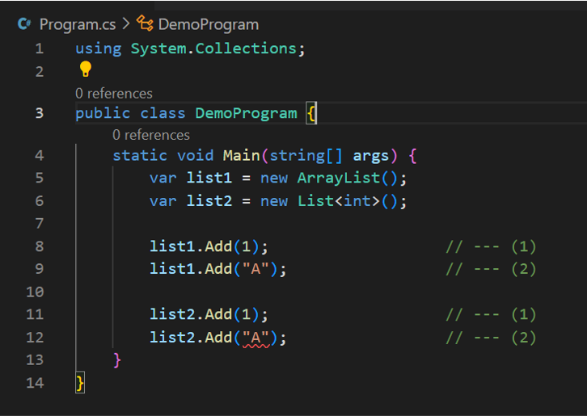

# Unit 1 - Programming 

[Home](README.md) | [Prev](07_Methods.md) | [Next](09_CSV.md)

## 8.1. Data Structures 101

- In computer science, a data structure is a data organization, management, and storage format that is usually chosen for efficient access to data.
- More precisely, a data structure is a collection of data values, the relationships among them, and the functions or operations that can be applied to the data, i.e., it is an algebraic structure about data.
- Different types of data structures are suited to different kinds of applications, and some are highly specialized to specific tasks.
- Data structures provide a means to manage large amounts of data efficiently for uses such as large databases and internet indexing services.
- Examples:
    - Array:
        - a number of elements in a specific order, typically all of the same type (depending on the language, individual elements may either all be forced to be the same type, or may be of almost any type)
        - Elements are accessed using an integer index to specify which element is required.
        - Typical implementations allocate contiguous memory words for the elements of arrays (but this is not always a necessity).
        - Arrays may be fixed-length or resizable.
    - Linked List (aka List):
        - also just called list
        - linear collection of data elements of any type, called nodes, where each node has itself a value, and points to the next node in the linked list.
        - The principal advantage of a linked list over an array is that values can always be efficiently inserted and removed without relocating the rest of the list.
        - Certain other operations, such as random access to a certain element, are however slower on lists than on arrays.
    - Record/Tuple
        - An aggregate data structure.
        - A record is a value that contains other values, typically in fixed number and sequence and typically indexed by names.
        - The elements of records are usually called fields or members.
        - In the context of object-oriented programming, records are known as plain old data structures to distinguish them from objects.

## 8.2 Data Structures in C\#

- C# supports a large number of collections which are designed for various purposes.

<table>
    <thead>
      <tr>
        <th>Type</th>
        <th>Description</th>
      </tr>
    </thead>
    <tbody>
      <tr>
        <td><pre lang="c#">Dictio­nar­y&lt;T­Key­,TV­alu­e&gt;</pre></td>
        <td>Represents a collection of key/value pairs that are organized based on the key.</td>
      </tr>
      <tr>
        <td><pre lang="c#">List&lt;T&gt;</pre></td>
        <td>Represents a list of objects that can be accessed by index. Provides methods to search, sort, and modify lists.</td>
      </tr>
      <tr>
        <td><pre lang="c#">Queue&lt;­T&gt;</pre></td>
        <td>Represents a first in, first out (FIFO) collection of objects.</td>
      </tr>
      <tr>
        <td><pre lang="c#">Sorted­Lis­t&lt;T­Key­,TV­alu­e&gt;</pre></td>
        <td>Represents a collection of key/value pairs that are sorted by key based on the associated <code lang="c#">ICompa­rer­&lt;T&gt;</code> implem­ent­ation.</td>
      </tr>
      <tr>
        <td><pre lang="c#">Stack&lt;­T&gt;</pre></td>
        <td>Represents a last in, first out (LIFO) collection of objects</td>
      </tr>
    </tbody>
</table>

- Generics: Collections allow defining ***type variables*** that enables adding type safety to collections. This is achieved with generics
    - E.g. Assume a `List`. How can we enforce that only integers are allowed in this list?
    - `List<int>`: Compiler understands this as only integers are allowed in this list. If we attempt to add something which is not of type `int`, there will be a compile time error.



- In the above
    1. <b style="color: green;">&#x2714;</b> This is valid, because `ArrayList` allows values of any type
    2. <b style="color: green;">&#x2714;</b> This is valid, because `ArrayList` allows values of any type
    3. <b style="color: green;">&#x2714;</b> This is valid, because `List` here allows values of type `int`
    4. <b style="color: red;">&#x274C;</b> This is invalid, because `List` here only allows values of type `int`

## 8.2.1 [`List<T>`](https://learn.microsoft.com/en-us/dotnet/api/system.collections.generic.list-1)

- The List<T> is a collection of strongly typed objects that can be accessed by index
- Available under the `System.Collections.Generic` namespace

```csharp
List<int> primeNumbers = new List<int>();
primeNumbers.Add(1); // adding elements using add() method
primeNumbers.Add(3);
primeNumbers.Add(5);
primeNumbers.Add(7);

var cities = new List<string>();
cities.Add("New York");
cities.Add("London");
cities.Add("Mumbai");
cities.Add("Chicago");
cities.Add(null);// nulls are allowed for reference type list

//adding elements using collection-initializer syntax
var bigCities = new List<string>()
                    {
                        "New York",
                        "London",
                        "Mumbai",
                        "Chicago"                    
                    };
```

- `List` provides methods for sorting, searching, and modifying itself
    - `void Add(T item)`: Adds `item` at the end of the list
    - `void AddRange(IEnumerable<T> collection)`: Adds a collection of elements at the end of the list
    - `void Insert(int index, T item)`: Inserts `item` at the index specified by `index`
    - `bool Remove(T item)`: Remove `item` if it exists in the list; returns `True` if success, `False` otherwise
    - `void RemoveAt(int index)`: Removes the element at the `index`
    - `bool Contains(T item)`: Checks if `item` exists in the list and return a boolean indicating whether the item is there

## 8.2.2 [`Dictionary<K, V>`](https://learn.microsoft.com/en-us/dotnet/api/system.collections.generic.dictionary-2)

- The `Dictionary<TKey, TValue>` is a generic collection that stores key-value pairs in no particular order
- Comes under the `System.Collections.Generic` namespace
- Keys must be unique and cannot be null
- Values can be null or duplicate
- Values can be accessed by passing associated key in the indexer e.g. `myDictionary[key]`

```csharp
Dictionary<int, string> numberNames = new Dictionary<int, string>();
numberNames.Add(1,"One"); //adding a key/value using the Add() method
numberNames.Add(2,"Two");
numberNames.Add(3,"Three");

//The following throws run-time exception: key already added.
//numberNames.Add(3, "Three"); 

foreach(KeyValuePair<int, string> kvp in numberNames) {
  Console.WriteLine("Key: {0}, Value: {1}", kvp.Key, kvp.Value);
}
        
//creating a dictionary using collection-initializer syntax
var cities = new Dictionary<string, string>(){
  {"UK", "London, Manchester, Birmingham"},
  {"USA", "Chicago, New York, Washington"},
  {"India", "Mumbai, New Delhi, Pune"}
};
        
foreach(var kvp in cities)
    Console.WriteLine("Key: {0}, Value: {1}", kvp.Key, kvp.Value);
```

- Reading values from dictionaries can be done as follows.

```csharp
var cities = new Dictionary<string, string>(){
  {"UK", "London, Manchester, Birmingham"},
  {"USA", "Chicago, New York, Washington"},
  {"India", "Mumbai, New Delhi, Pune"}
};

Console.WriteLine(cities["UK"]); //prints value of UK key
Console.WriteLine(cities["USA"]);//prints value of USA key
//Console.WriteLine(cities["France"]); // run-time exception: Key does not exist

//use ContainsKey() to check for an unknown key
if(cities.ContainsKey("France")){  
  Console.WriteLine(cities["France"]);
}

//use TryGetValue() to get a value of unknown key
string result;

if(cities.TryGetValue("France", out result))
{
  Console.WriteLine(result);
}

//use ElementAt() to retrieve key-value pair using index
for (int i = 0; i < cities.Count; i++)
{
  Console.WriteLine("Key: {0}, Value: {1}", cities.ElementAt(i).Key, cities.ElementAt(i).Value);
}
```

- `Dictionary` provides methods for sorting, searching, and modifying itself
    - `void Add(TKey key, TValue value)`: Adds `value` under the `key`
    - `void Clear()`: Removes all keys and values from the `Dictionary<TKey,TValue>`.
    - `bool ContainsKey(TKey key)`: Determines whether the `Dictionary<TKey,TValue>` contains the specified `key`.
    - `bool ContainsValue(TValue value)`: Determines whether the `Dictionary<TKey,TValue>` contains a specific `value`.
    - `bool Remove(TKey key)`: Removes the value with the specified `key` from the `Dictionary<TKey,TValue>`.
    - `bool Remove(TKey key, out TValue value)`: Removes the value with the specified `key` from the `Dictionary<TKey,TValue>`, and copies the element to the `value` parameter.
    - `bool TryAdd(TKey key, TValue value)`: Attempts to add the specified `key` and `value` to the dictionary.
    - `bool TryGetValue(TKey key, out TValue value)`: Gets the value associated with the specified `key` and assigns to the variable `value`.

***
[Home](README.md) | [Prev](07_Methods.md) | [Next](09_CSV.md)