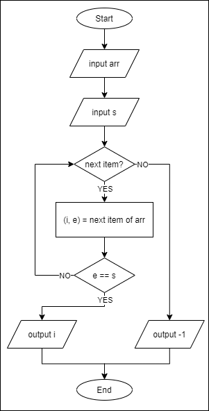
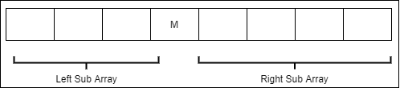
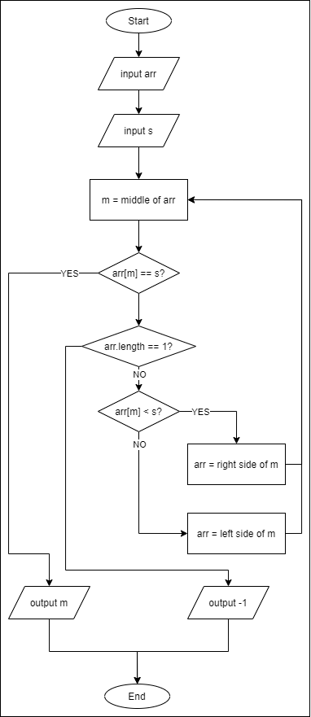
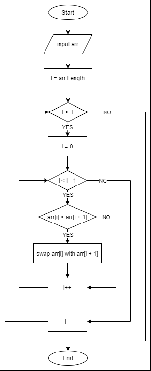
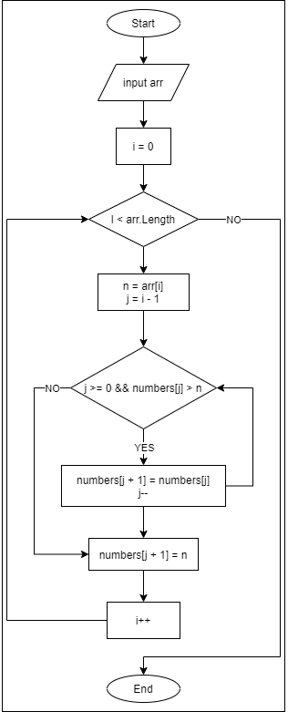
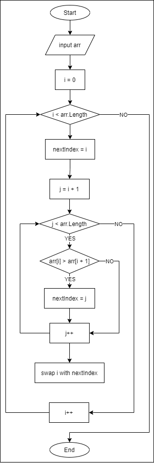

# Unit 1 - Programming 

[Home](README.md) | [Prev](08_DataStructures.md) | [Next](10_AppDev.md)

## 9.1 Algorithms

- An algorithm is a finite sequence of rigorous instructions, typically used to solve a class of specific problems or to perform a computation.
- Algorithms are used as specifications for performing calculations and data processing.
- Examples
	- Searching: Finding a specific element in a collection
		- Linear Search
		- Binary Search
	- Sorting: Arranging the elements of a linear data structure, in the ascending/descending order of a specific field value
		- Bubble Sort
		- Insertion Sort
		- Selection Sort

## 9.2 Searching Algorithms

- Searching algorithms are used to find a specific item in a collection.
- There are two basic algorithms for searching an item.

### 9.2.1 Linear Search

- The traversal begins from the first item of the data structure.
- Each item is evaluated to check if it is the item that is being searched for.
- The search stops when it hits the item that's being searched for, or the last item is evaluated (which ever comes first).
- Performance: For $n$ items, if it takes $t$ milliseconds to evaluate each item,
	- Best case occurs when the item that's being searched for, is found at the first location. Then it will take only $t$ seconds.
	- Average case occurs when the item was found in the midway of the traversal. This will take $t \times n/2$ seconds.
	- Worst case occurs when the item was not found even after the last element was evaluated. This will take $n \times t$ seconds



```csharp
static int LinearSearch(int[] array, int key) {
  int keyIndex = -1; // If the item wasn't found, this will remain at -1

  for(int i = 0; i < array.Length; i++) {
    if (array[i] == key) {
      keyIndex = i; // Item found at index i; so break the loop
      break;
    }
  }

  return keyIndex;
}
```

### 9.2.2 Binary Search

- Find the middle item of the array.
- If the middle item is not what is being searched for
	- If the array has only one element, terminate the search, because there's nothing to look further in.
	- Otherwise, narrow the search to one of the following and start the search over.
		- ***Left Sub Array***: if the item in the middle is greater than what is being searched for
		- ***Right Sub Array***: if the item in the middle is less than what is being searched for



- Performance: For $n$ items, if it takes $t$ milliseconds to evaluate each item,
	- Best case occurs when the item that's being searched for, is found at the middle of the input array. Then it will take only $t$ seconds.
	- Worst case occurs when the item was not found even after the last element was evaluated. However, we will have to evaluate at most only $\log_2 n$ elements. Hence this will take $log_2 n \times t$ seconds



### 9.3 Sorting Algorithms

- Sorting algorithms are used to arrange the items in a linear data structures in ascending/descending order.
- Following are some of the basic algorithms for sorting.

### 9.3.1 Bubble Sort

- Each pair of adjacent items (items that are next to each other) are compared.
- If they are in the incorrect order, their places are swapped.
- Right side item of the current pair, will be the left side item of the next pair. E.g. for items `[10, 8, 12, 7, 9]` to be sorted in the ascending order

```
(10, 8)  -> Incorrect order, hence swap  -> (8, 10)
(10, 12) -> Correct order, hence no swap -> (10, 12)
(12, 7)  -> Incorrect order, hence swap  -> (7, 12)
(12, 9)  -> Incorrect order, hence swap  -> (9, 12)
No more pairs -> [8, 10, 7, 9, 12]
```

- We can see that we have managed to find the largest item and bring it to the very end of the array, where it should be once it is sorted.
- The above is repeated in each iteration, for the sub array which is unsorted, until the first pair of items sorted.
Sorting Order:
	- For ascending order, of each pair, left side item < right side item 
	- For descending order, of each pair, left side item > right side item
- YouTube Video - [Bubble Sort Algorithm - [with Animated Example]](https://www.youtube.com/watch?v=J9Xws0uRB24)



```csharp
static void BubbleSort(int[] numbers, bool asc) {
  for(int l = numbers.Length; l > 1; l--) {
    for(int i = 0; i < l - 1; i++) {
      bool shouldSwap = numbers[i] < numbers[i + 1];

      if (asc) {
        shouldSwap = numbers[i] > numbers[i + 1];
      }

      if (shouldSwap) {
        int tmp = numbers[i];
        numbers[i] = numbers[i + 1];
        numbers[i + 1] = tmp;
      }
    }
  }
}
```

### 9.3.2 Insertion Sort

- Virtually partition the array into two partitions, the sorted partition and the unsorted partition.
	- In the beginning, the unsorted partition has no elements and the entire array is the unsorted partition.
- Each of the elements remaining in the unsorted partition, is inserted into the position at which it belongs.
- YouTube Video - [Insertion Sort Algorithm [Easily Explained]](https://www.youtube.com/watch?v=rnEAv9hAfwA)



```csharp
static void InsertionSort(int[] numbers) {
  for(int i = 0; i < numbers.Length; i++) {
    int n = numbers[i];
    int j = i - 1;
    
    while(j >= 0 && numbers[j] > n) {
      numbers[j + 1] = numbers[j];
      j--;
    }

    numbers[j + 1] = n;
  }
}
```

### 9.3.3 Selection Sort

- Virtually partition the array into two partitions, the sorted partition and the unsorted partition (similar to the insertion sort above).
	- In the beginning, the unsorted partition has no elements and the entire array is the unsorted partition.
- Smallest/largest (depending on the sort direction) will be chosen (hence the name *selection*) from the unsorted partition and will be added to the end of the sorted partition, for each of the items remaining in the sorted partition.
- YouTube Video - [Selection Sort Algorithm [Easily Explained]](https://www.youtube.com/watch?v=aeFnHjbVWQ4)



```csharp
static void SelectionSort(int[] numbers, bool asc) {
    for(int i = 0; i < numbers.Length; i++) {
      int mi = i;

      for (int j = i + 1; j < numbers.Length; j++) {
        bool shouldBeNext = numbers[j] > numbers[mi];

        if (asc) {
          shouldBeNext = numbers[j] > numbers[mi];
        }

        if (shouldBeNext) {
          mi = j;
        }
      }

      int t = numbers[i];
      numbers[i] = numbers[mi];
      numbers[mi] = t;
    }
}
```

## 9.4 Things to Remember

- There can be multiple algorithms that performs the same task/achieves the same result.
- Choosing an algorithm should be based on 
	- **Time Complexity**: How much of time it would take to find a solution (faster the better)
	- **Space Complexity**: How much of memory it will consume to find a solution (lower the better)

***
[Home](README.md) | [Prev](08_DataStructures.md) | [Next](10_AppDev.md)