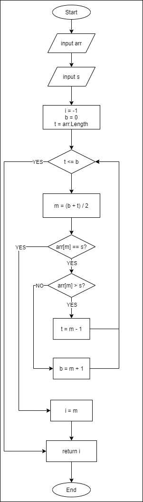

# Unit 1 - Programming 

[Home](README.md) | [Prev](08_DataStructures.md) | [Next](10_AppDev.md)

## 9.1 Algorithms

- An algorithm is a finite sequence of rigorous instructions, typically used to solve a class of specific problems or to perform a computation.
- Algorithms are used as specifications for performing calculations and data processing.
- Examples
	- Searching: Finding a specific element in a collection
		- Linear Search
		- Binary Search
	- Sorting: Arranging the elements of a linear data structure, in the ascending/descending order of a specific field value
		- Bubble Sort
		- Insertion Sort
		- Selection Sort

## 9.2 Searching Algorithms

- Searching algorithms are used to find a specific item in a collection.
- There are two basic algorithms for searching an item.

### 9.2.1 Linear Search

- The traversal begins from the first item of the data structure.
- Each item is evaluated to check if it is the item that is being searched for.
- The search stops when it hits the item that's being searched for, or the last item is evaluated (which ever comes first).
- Performance: For $n$ items, if it takes $t$ milliseconds to evaluate each item,
	- Best case occurs when the item that's being searched for, is found at the first location. Then it will take only $t$ seconds.
	- Average case occurs when the item was found in the midway of the traversal. This will take $t \times n/2$ seconds.
	- Worst case occurs when the item was not found even after the last element was evaluated. This will take $n \times t$ seconds


```csharp
static int LinearSearch(int[] array, int key) {
	int keyIndex = -1; // If the item wasn't found, this will remain at -1

	for(int i = 0; i < array.Length; i++) {
		if (array[i] == key) {
			keyIndex = i; // Item found at index i; so break the loop
			break;
		}
	}

	return keyIndex;
}
```

### 9.2.2 Binary Search

- Find the middle item of the array.
- If the middle item is not what is being searched for
	- If the array has only one element, terminate the search, because there's nothing to look further in.
	- Otherwise, narrow the search to one of the following and start the search over.
		- ***Left Sub Array***: if the item in the middle is greater than what is being searched for
		- ***Right Sub Array***: if the item in the middle is less than what is being searched for


- Performance: For $n$ items, if it takes $t$ milliseconds to evaluate each item,
	- Best case occurs when the item that's being searched for, is found at the middle of the input array. Then it will take only $t$ seconds.
	- Worst case occurs when the item was not found even after the last element was evaluated. However, we will have to evaluate at most only $\log_2 n$ elements. Hence this will take $log_2 n \times t$ seconds



### 9.3 Sorting Algorithms

### 9.3.1 Bubble Sort

### 9.3.2 Insertion Sort

### 9.3.3 Selection Sort

***
[Home](README.md) | [Prev](08_DataStructures.md) | [Next](10_AppDev.md)