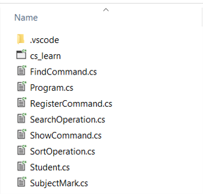

# Student Management System - A Console Application

## Requirements and Scope

- A simple console application with a CLI that manages students' information
- Users can
  - Add new students, with the courses that they are enrolled in and marks (between 0 and 100)
  - Students are enrolled for exactly four (04) subjects
  - Find students by their 4-digit ID
  - View all students sorted by their IDs in the ascending order
  - Find a specific student by the ID
- Each input should be validated where necessary. If the user has given an invalid input, the error should be displayed on screen, and the user shall be taken back to the input prompt.

## Initial Scaffold

- Our main method shall be written as follows. This will allow us to obtain the users input, and process it as a command. If it is a vaild command, we can execute the method pertaining to that command, otherwise we can display an error saying that the command is invalid.

```csharp
class StudentManagementSystem {
  static void Main(string[] args) {
    Console.WriteLine("Student Management System v1.0");      // --- (1)
    Console.WriteLine("Welcome!");
    Console.WriteLine("");
    
    while(true) {                                             // --- (2)
      Console.Write("SMS> ");                                 // --- (3)
      string command = Console.ReadLine().ToLower();          // --- (4)
      
      switch(command) {                                       // --- (5)
        case "new student":
          // RegisterNewStudent();                            // --- (a)
          break;
  
        case "all students":
          // ShowAllStudentsSortedById();                     // --- (b)
          break;
  
        case "find student":
          // FindStudent();                                    // --- (c)
          break;
  
        case "exit":
          Console.WriteLine("Bye!");                          // --- (d)
          return;
  
        default:
          Console.WriteLine($"Invalid Command: {command}");   // --- (6)
          break;
      }
      Console.WriteLine();
    }
  }
}
```

- In the above,
    1. This is the banner. This will display when the application is launched for the first time.
    2. This `while` loop keeps iterating its body. Each iteration we process a command and once the processing is completed, it will display the prompt and wait for user input.
    3. This is the prompt.
    4. Here, we obtain the users keyboard input and assign it to a variable.
    5. This `switch` block identifies the command. If it is a command which is not a case in the `switch` block, it will fall on to #6 below. Each case has a method, where each method contains the process that should be executed when the corresponding command is given in. (Don't worry, the method calls below will give you errors for now. Just keep them commented. We can uncomment them when we complete writing the methods.)
        - a. `RegisterNewStudent()`: Commences the student registration process.
        - b. `ShowAllStudentsSortedById()`: Displays the current list of students sorted by the ID.
        - c. `FindStudent()`: Find a specific student by the student ID.
        - d. Exits from the application. Here, we will return from the main method after displaying a message.
    6. This is the `default` case. Falls back on to this case when the given input is unknown. We will display the error, and start the loop over.

## Data Representation

- The data we need to represent and manage here, are structured. Hence, we can use `struct` types to represent student and course information. ([Read more about `struct`](https://www.tutorialsteacher.com/csharp/csharp-struct))
- **`Student`**: This is the representation of the student data

```csharp
struct Student {
  public int Id;
  public string FirstName;
  public string LastName;
  public SubjectMark[] SubjectMarks;
}
```

- **`SubjectMark`**: This is the representation of the subject mark data

```csharp
struct SubjectMark {
  public string SubjectName;
  public double Mark;
}
```

- These structs can be used to create instances, that allows us to set the values.

```csharp
Student student = new Student();    // --- (1)

// Setting stdent properties        // --- (2)
student.FirstName = "john";
student.LastName = "doe";
student.Id = 1594;
```

- Here,
    1. This is where the instance of the struct is created.
    2. This is where the properties of the newly created instances are set. `student.FirstName` is analogous to the english phrase ***FirstName of the student***. `.` in C# is the equivalent of the english preposition ***of***.
- These structs can and should be defined in separate files, for the clean coding and maintainability purposes.
- There will be many students registered. There information should be stored and accessible by all the methods in the application. So, we can create a collection of students. For this we will use an `ArrayList`. We will change our `StudentManagementSystem` class as follows.

```csharp
class StudentManagementSystem {
  public static ArrayList students = new ArrayList();    // --- (1)

  static void Main(string[] args) {
     // Main method will remain as it was.
  }
}
```
- Here
    1. This is the creation of the `ArrayList`. Since this is in the class scope, this will be visible to all the methods. Everytime we create a new student instance, we can add it to this array list.
- If we are to write everything in the same `.cs` file, there will be so much text. To avoid this, we can split the definition of a single class across multiple files.
- For this we need to modify our class `StudentManagementSystem`, with `partial` keyword. Now the class should look like follows.

```csharp
partial class StudentManagementSystem {
  public static ArrayList students = new ArrayList();    // --- (1)

  static void Main(string[] args) {
     // Main method will remain as it was.
  }
}
```
- When building, the compiler will know that each partial class with the same class name should be compiled into a single entity.

## Core Functionality

### Registering Students

- We will provide the implementation for `RegisterNewStudent()` method mentioned before. The implementation would look like follows.

```csharp
partial class StudentManagementSystem {
  static void RegisterNewStudent() {
    Student newStudent = new Student(); // Student instance
    newStudent.SubjectMarks = new SubjectMark[4]; // Subject mark array

    Console.WriteLine("Please Enter your personal details");

    // Try this on until the user gives a valid input
    while (true) {
      Console.Write("Student ID: ");
      string studentIdInput = Console.ReadLine();
      bool idParseSuccess = Int32.TryParse(studentIdInput, out int newStudentId);

      if (idParseSuccess) { // User gave a valid integer input
        if (newStudentId >= 1000 && newStudentId <= 9999) { // ID is within the acceptable range
          newStudent.Id = newStudentId;
          break;
        }
      }
      
      // Invalid input for student ID:
      Console.WriteLine($"Invalid input {studentIdInput} for student ID. Should be a 4 digit number.");
    }

    Console.Write("First Name: ");
    newStudent.FirstName = Console.ReadLine(); // Obtain the first name input and set it

    Console.Write("Last Name: ");
    newStudent.LastName = Console.ReadLine();
    
    int i = 0;

    // 4 subjects, we try this on for as many times as necessary,
    // until all subjects are properly filled
    while (i < 4) { 
      Console.WriteLine($"Subject {i + 1} Information");

      Console.Write("\tSubject Name: ");
      string subjectName = Console.ReadLine();

      Console.Write("\tMark: ");
      string markInput = Console.ReadLine();

      // Try to parse the mark input
      bool parseSuccess = Double.TryParse(markInput, out double mark);

      if (parseSuccess) { // Valid integer input is given
        if (mark >= 0 && mark <= 100) { // Mark is within the valid range
          newStudent.SubjectMarks[i].SubjectName = subjectName; // Set the subject name
          newStudent.SubjectMarks[i].Mark = mark; // Set the mark
          i++; // Increase i, move to next subject
        } else {
          Console.WriteLine("\tMark is invalid. Try Again!");
        }
      } else {
        Console.WriteLine("\tMark is invalid. Try Again!");
      }
    }

    students.Add(newStudent); // Add the newly created student to the students array list

    Console.WriteLine("New Student has been successfully registered."); // Display message
  }
}
```
- We will write this in a separate file. Let's use `RegisterCommand.cs` as the file name, so that the file name implies its intention.
- Now we can uncomment the line that calls the method `RegisterNewStudent` in the main method.
- At this point, you should be able to run the application. If you give the command `new student`, you should go through the process of creating a new student, and at the end the student information should be added to the array list `students`.

### Show All Students (sorted by ID)

- We will provide the implementation for `ShowAllStudentsSortedById()` method mentioned before. Before this, we will need to provide some sorting operation.
- Here we will use the selection sort ([see 9.Algorithms])(09_Algorithms.md#933-selection-sort) operation.
- Again, this will go in a separate file named `SortingOperation.cs`.

```csharp
partial class StudentManagementSystem {
  // Sort the students by their IDs. Here we use Selection Sort algorithm
  static void SortStudentsById(bool asc) {
    for(int i = 0; i < students.Count; i++) {
      int nextStudentIndex = i;

      for (int j = i + 1; j < students.Count; j++) {
        Student currentStudent = (Student) students[j];
        Student nextStudent = (Student) students[nextStudentIndex];
        
        bool shouldBeNext = currentStudent.Id > nextStudent.Id;

        if (asc) {
          shouldBeNext = currentStudent.Id < nextStudent.Id;
        }

        if (shouldBeNext) {
          nextStudentIndex = j;
        }
      }

      // Swap
      Student t = (Student) students[i];
      students[i] = students[nextStudentIndex];
      students[nextStudentIndex] = t;
    }
  }
}
```
- Now that the sort operation is ready, we can provide the implementaion of `ShowAllStudentsSortedById()` in another separate file named `ShowCommand.cs`.

```csharp
partial class StudentManagementSystem {
  static void ShowAllStudentsSortedById() {    // --- (1)
    SortStudentsById(true);
    Console.WriteLine("------------------------------------");
    foreach(Student student in students) {
      ShowStudent(student);
    }
    Console.WriteLine("------------------------------------");
    Console.WriteLine($"Found {students.Count} student records.");
  }

  static void ShowStudent(Student student) {   // --- (2)
    Console.WriteLine($"{student.Id} {student.FirstName} {student.LastName}");
  }
}
```
- This file contains two methods.
    1. The method invoked when the command is given. This is to display all the students after sorting.
    2. The method that displays the details of a single student.
- The reason why we are having two separate methods is that these two are separate tasks. Showing multiple students' information actually means, showing a single student's information ***repeated multiple times***. A method is supposed to do ***only one thing and one thing alone***.
- Now we can uncomment the line that calls the method `ShowAllStudentsSortedById()`.

### Find Student by ID

- Before implementing the actual command method, we need to implement a searching algorithm.
- We will implement the binary search algorithm.
- Binary search works only on ***sorted*** data structures. For that we can use our `SortStudentsById()` written in the `SortOperation.cs` file.
- We will put the following implementation in a separate file named `SearchOperation.cs`.

```csharp
partial class StudentManagementSystem {
  // Search a specific student by the student ID. We use binary search algorithm
  static int SearchStudentById(int studentId) {
    SortStudentsById(true);
    
    int bottomOfTheSubArray = 0;
    int topOfTheSubArray = students.Count;
    int resultIndex = -1;

    while (true) {
      if (topOfTheSubArray <= bottomOfTheSubArray) {
        // top and bottom pointers pointing at the same index
        // this means that there's nothing further to search in
        // we haven't found our item, so let's break the loop
        break;
      }

      int middleIndex = (topOfTheSubArray + bottomOfTheSubArray) / 2;
      Student studentInTheMiddle = (Student) students[middleIndex];

      if (studentInTheMiddle.Id == studentId) {
        // we have found our item, so let's break the loop
        // before breaking the loop, we will set the middleIndex as the resultIndex
        resultIndex = middleIndex;
        break;
      } else if (studentId > studentInTheMiddle.Id) {
        // The id we are looking for is greater than what we found in the middle.
        // So we narrow our search to the right sub array
        bottomOfTheSubArray = middleIndex + 1;
      } else if (studentId < studentInTheMiddle.Id) {
        // The id we are looking for is less than what we found in the middle.
        // So we narrow our search to the left sub array
        topOfTheSubArray = middleIndex - 1;
      }
    }

    return resultIndex;
  }
}
```
- Now we can implement the command method `FindStudent()` as follows. We will put this in `FindCommand.cs` file.

```csharp
partial class StudentManagementSystem {
  static void FindStudent() {
    Console.Write("Student ID (4 digit ID code):");
    
    string idInput = Console.ReadLine();
    bool parseSuccess = Int32.TryParse(idInput, out int studentId);

    if (parseSuccess) {
      SortStudentsById(true); // We start by sorting the students by ID

      int index = SearchStudentById(studentId);

      if (index == -1) {
        Console.WriteLine($"WARN: No Student was found for the ID {idInput}");
      } else {
        Student foundStudent = (Student) students[index];
        ShowStudent(foundStudent);
      }
    } else {
      Console.WriteLine($"ERROR: Invalid ID {idInput}");
    }
  }
}
```
- Now we can uncomment the line that calls the method `FindStudent()`.

## Conclusion

- Once the coding is completed, our project folder should look like follows.



- That's it. Now you should be able to build and run this application. You can use the VS Code's debugging features to identify when you have any errors in your code.
